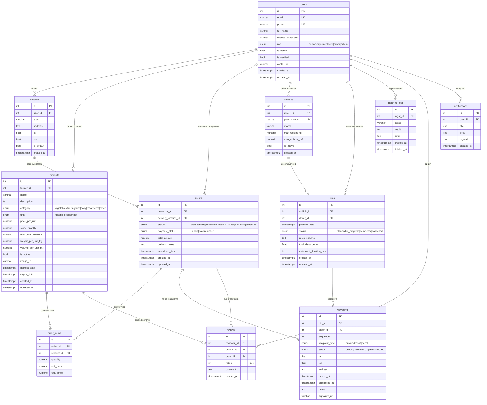

# AgroHub Logistic — Схема базы данных

## Таблицы

| Таблица | Назначение |
|---|---|
| **users** | Все пользователи с ролями (customer, farmer, logist, driver, admin) |
| **locations** | Адреса пользователей (с координатами), адрес доставки заказа |
| **products** | Товары фермеров (категория, цена, склад, вес/объём для VRP) |
| **orders** | Заказы покупателей со статусом и оплатой |
| **order_items** | Позиции заказа (товар + кол-во + цена) |
| **vehicles** | Транспортные средства с ограничениями веса/объёма |
| **trips** | Рейсы (маршруты), результат VRP-планирования |
| **waypoints** | Точки маршрута рейса (тип: pickup/dropoff/depot, подпись водителя) |
| **planning_jobs** | Асинхронные задачи VRP-планирования (APScheduler) |
| **reviews** | Отзывы на товары и заказы (рейтинг 1–5) |
| **notifications** | Уведомления пользователям |
